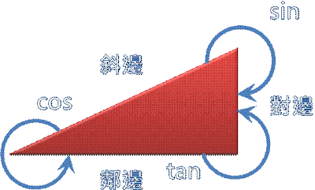

# 數學基礎筆記

---

## 數學金字塔

- 向量、矩陣、微積分
- 分析(函數) / 代數（一元二次方程式）
- 幾何（三角形與圓形）
- 座標與圖形、二次函數、圖形關係與證明
- 數學式、集合與機率、平面圖形與立體圖形的性質

> 將事物用數學來表現，將數字用字母符號代替

---

## 四則運算

- 交換律：$a + b = b + a$
- 結合律：$(a + b) + c = a + (b + c)$
- 分配律：$a(b + c) = ab + ac$
- 減法是加上負數：$a - b = a + (-b)$
- 除法是乘上倒數：$a \div b = a \times \frac{1}{b}$

> 小提醒：分配律常用於展開與因式分解。

---

## 機率與集合

- 文氏圖（Venn Diagram）用來表示集合關係。
- 得摩根定律：$(A \cup B)^c = A^c \cap B^c$，$(A \cap B)^c = A^c \cup B^c$
- 命題的邏輯推理：如「若 A 則 B」等。
- 邏輯沒有模糊空間，但機率有。
- 機率：事件發生的可能性，$P(A) = \frac{\text{有利結果數}}{\text{所有可能結果數}}$
- 條件機率：$P(A|B) = \frac{P(A \cap B)}{P(B)}$
- 貝氏定理：$P(A|B) = \frac{P(B|A)P(A)}{P(B)}$

**例子：**
擲一顆骰子，出現偶數的機率？

$$
P(\text{偶數}) = \frac{3}{6} = 0.5
$$

---

## 函數

**定義：** 一個輸入對應一個輸出。

一般函數表示：
$$y = f(x)$$

### 一元一次方程式（線性函數）

$$y = ax + b$$

> 圖形為直線，$a$ 為斜率，$b$ 為截距。

#### 直線斜率

$$
\text{斜率公式：}\frac{\Delta y}{\Delta x}
$$

### 一元二次方程式（拋物線）

> 多少次方就會有多少峰谷，例如二次方程式就是 U 字型

$$y = ax^2 + bx + c$$
**解釋：**

- 配方法：將二次方程式 $ax^2 + bx + c$ 轉換成 $(x + d)^2 + e$ 的形式，方便判斷頂點與開口方向。
- 因式分解：將二次方程式拆成兩個一次因式的乘積，如 $ax^2 + bx + c = (x+p)(x+q)$，可用於求根。
- 公式解：利用求根公式 $x = \frac{-b \pm \sqrt{b^2 - 4ac}}{2a}$ 直接計算方程式的解。

> 圖形為拋物線，$a>0$ 開口向上，$a<0$ 開口向下，有最大或最小值。

---

## 幾何

### 三角形

- 畢氏定理：$a^2 + b^2 = c^2$
- 內角和 $180^\circ$
- 直角三角形的三角函數應用

### 圓形

- 圓周長 $C = 2\pi r$
- 圓面積 $A = \pi r^2$

---

## 二項式定理與指數運算

### 二項式展開

$$
(x+y)^n = \sum_{k=0}^{n} \binom{n}{k} x^{n-k} y^k
$$

### 指數函數

$$
y = a^x
$$

- 指數運算規則：

1.  $$
    a^m \times a^n = a^{m+n}
    $$
2.  $$
    \frac{a^m}{a^n} = a^{m-n}
    $$

3.  $$
    a^0 = 1 ;\qquad a^{-n} = \frac{1}{a^n}
    $$

4.  $$
    (a^m)^n = a^{mn}
    $$

5.  $$
    (a \times b)^n = a^n b^n
    $$

6.  $$
    \left(\frac{a}{b}\right)^n = \frac{a^n}{b^n}
    $$

### 對數函數

$$
y = \log_a x \iff x = a^y
$$

### 尤拉數

$e$：自然對數的底數，$e \approx 2.718$

### 邏輯斯函數

> Logistic Function

**邏輯斯函數定義：**

$$
f(x) = \frac{1}{1 + e^{-x}}
$$

- 輸入 $x$ 經過邏輯斯函數後，輸出值會介於 $0$ 到 $1$ 之間。
- 常用於描述機率（如二元分類），也是神經網路中的激活函數之一。
- 圖形呈現 S 型曲線，當 $x$ 趨近於正無限大時，$f(x)$ 趨近於 $1$；當 $x$ 趨近於負無限大時，$f(x)$ 趨近於 $0$。
- 在統計學、機器學習（如邏輯迴歸）中廣泛應用。
  常用於機率、統計、AI。

### 三角函數

$$
\sin \theta = \frac{\text{對邊}}{\text{斜邊}},\quad \cos \theta = \frac{\text{鄰邊}}{\text{斜邊}},\quad \tan \theta = \frac{\text{對邊}}{\text{鄰邊}}
$$

### 畢氏定理

> （計算兩點距離）

$$
c = \sqrt{a^2 + b^2}
$$

---

## 微積分（Calculus）

微積分是研究「變化」與「累積」的數學領域，包含極限、導數、積分等主題。

> 詳細內容請見：[微積分專章](./calculus.md)
